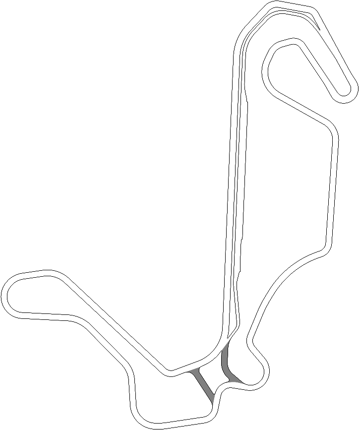

# CarPro — Full Physics Racing Simulator

> 로비에서 차를 고르고, 트랙을 골라 달리는 **웹 레이싱 게임**
> React + TypeScript + Vite · 차종별 풀 피직스(ICE/EV, FWD/RWD/AWD) · 자체 설계 서킷



## 게임 구성

**로비 → 차량 선택 → 트랙 선택 → 3·2·1·GO → 랩타임 어택** (ESC로 로비 복귀)

### 차량 5종

| 차량 | 구동 | 출력 | 특징 |
| --- | --- | --- | --- |
| Toyota GR86 | RWD | 237 ps | 수평대향 4기통 NA, 밸런스의 교과서 |
| Hyundai 아반떼 N | FWD | 280 ps | 2.0T 핫해치 — 앞바퀴 그립 관리가 핵심 |
| Porsche 911 카레라 S | RWD | 450 ps | 리어엔진 38:62 배분, 출구 트랙션 괴물 |
| Hyundai 아이오닉 5 N | AWD | 650 ps | **EV 모델** — 0 RPM부터 740Nm, 단일기어 + 회생제동 |
| F1 머신 | RWD | 1,000 ps | **다운포스 물리** — 속도가 붙을수록 그립 증가, 슬릭 + 카본 브레이크 |

차종별로 토크 커브(보간점), 기어비, 무게배분, 에어로(양력↔다운포스), 타이어 컴파운드,
브레이크 열용량, 엔진음 프로파일(수평4/직4/수평6/V6 1.6T/EV 모터 와인)이 전부 다릅니다.

### 트랙 3종

| 트랙 | 길이 | 난이도 | 비고 |
| --- | --- | --- | --- |
| 인제 스피디움 | 3.9 km | ★★★ | 실존 서킷 — map.png 픽셀 마스크 기반 |
| CarPro GP | 약 4.2 km | ★★ | **자체 설계** — Catmull-Rom 스플라인 → 노면 래스터화 |
| 스피드 오벌 | 약 3.1 km | ★ | 풀 스로틀 슈퍼스피드웨이 |

스플라인 트랙은 컨트롤 포인트만으로 정의되며, 빌드 시 센터라인을 래스터화해
주행 판정 마스크 / 아스팔트 노면 / 미니맵을 자동 생성합니다.
스타트 위치와 스타트라인은 커브 위에 자동 스냅됩니다 — 새 트랙 추가는 좌표 목록 하나면 끝.

## 실행 방법

```bash
npm install
npm run dev        # http://localhost:5173
npm run build      # 타입체크 + 프로덕션 빌드
```

딥링크: `?race=<carId>,<trackId>` (예: `?race=f1,carpro-gp`)로 로비를 건너뛰고 바로 주행할 수 있습니다.

### 레거시 버전 (v3, 단일 HTML)

GR86 + 인제 스피디움만 지원하는 이전 버전이 [legacy/main.html](legacy/main.html)에 보존되어 있습니다.

## 조작법

| 입력 | 기능 |
| --- | --- |
| `W` / `S` | 가속 / 브레이크 |
| `A` / `D` | 조향 |
| `Space` | 핸드브레이크 |
| `[` / `]` | 기어 다운 / 업 (EV는 R/N/D) |
| `1` / `2` / `3` | ABS / TC / ESC 토글 |
| `4` | TC 레벨 변경 |
| `L` / `C` / `R` / `H` | 타이밍 토글 / 스키드 삭제 / 리셋 / 도움말 |
| `ESC` | 로비로 복귀 |
| 🎮 게임패드 | 좌스틱 조향 · RT/LT 가감속 · RB/LB 시프트 · A 핸드브레이크 |

## 물리 엔진 하이라이트

| 항목 | 구현 내용 |
| --- | --- |
| 타이어 | Pacejka MF σ-결합슬립, 하중 민감도, 온도(비대칭 가우시안)/마모 모델 |
| 구동계 | FWD/RWD/AWD 토크 배분, 구동축별 TC 감시, 클러치 덤프 각운동량 보존 |
| EV | 단일 감속비 직결, 0 RPM 최대토크, 스로틀 오프 회생제동 |
| 에어로 | 양력(GR86) ↔ 다운포스(F1: 250km/h에서 차중의 ~2배) 연속 모델 |
| 브레이크 | m·c 열용량 + 페이드 (카본 브레이크는 900°C부터), 동적 EBD |
| 수치 적분 | 60 FPS × 8 서브스텝, 저속 발진 no-slip 스냅 가드 |

## 아키텍처

```
src/
├── engine/              # 프레임워크 독립 시뮬레이션 엔진 (순수 TS)
│   ├── cars.ts          #   차종 5종 스펙 + 토크커브 보간
│   ├── tracks.ts        #   트랙 정의 + Catmull-Rom 스플라인 샘플러
│   ├── physics.ts       #   Pacejka, 파워트레인(ICE/EV), 구동배분, 열역학, 보조장비
│   ├── track.ts         #   이미지 마스크 / 스플라인 래스터화 → 노면·미니맵 생성
│   ├── audio.ts         #   차종별 절차적 사운드 (ICE 하모닉 스택 / EV 사인 와인)
│   └── simulation.ts    #   configure(car,track), 게임 루프, 카운트다운, 랩 타이밍
├── render/renderer.ts   # 단일 캔버스 렌더 — 동적 줌, 차종별 비주얼(F1 윙/헤일로)
├── ui/                  # Lobby, Cluster(원형 게이지), TimingWidget, SystemsPod,
│   │                    # TelemetryPod, Minimap, Countdown, SettingsDrawer, HelpModal
├── store.ts             # zustand — 화면 전환(로비/레이스), 선택 상태, 텔레메트리
└── App.tsx              # screen 라우팅
```

- `engine/`은 React를 모름 — 매 프레임 텔레메트리 스냅샷을 zustand에 publish
- HUD는 세분화 selector 구독, 차량이 위젯 뒤로 지나가면 자동 페이드
- 속도 비례 동적 줌아웃(최대 35%) + 카메라 룩어헤드/셰이크
- 오프트랙 페널티: 그립 -25% / 구름저항 4배 / 엔진 -15%

## 기술 스택

**React 18 · TypeScript · Vite · zustand · Canvas 2D · Web Audio API** — 외부 게임엔진 없음

## 라이선스

학습 및 포트폴리오 목적의 프로젝트입니다.
